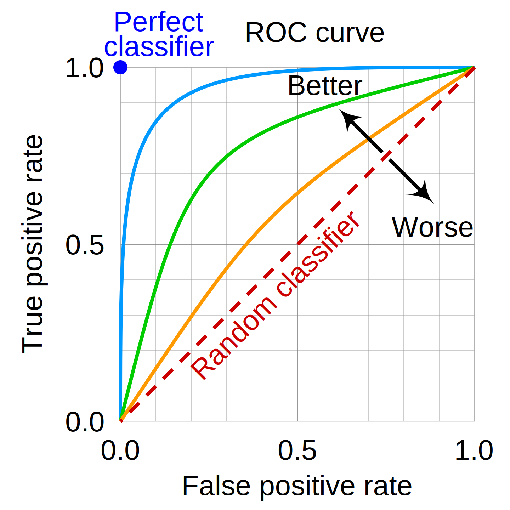

# Notes

## Accuracy
Accuracy is the ration between well classified items and the total of items. 

Example, suppose we have ten items to determine of the belong to a class $C$. Assume the ground truth is: $[1,1,1,1,0,0,1,1,0,0]$. And suppose that our model returns the following output: $[1,1,1,0,0,0,0,1,0,0]$. Notice that the output of our model and the ground truth differ on two items. Then the accuracy of out model is $\frac{8}{10}=0.8$. So, our model is not bad.

However, the accuracy is not good enough to evaluate the performance of a model. Check the following example: 
Suppose that we have a very unbalanced dataset with two items in class $C$ and 18 items that does not belong to $C$: $[1,1,0,0,\dots,0]$ then a trivial model that answer $0$ for every item would have an output $[0,0,\dots,0]$. Notice that our output only fails in the first two items so our accuracy is $\frac{18}{20}=0.9$ so, observing only the accuracy our model seems to be very good, but this is due to the imabalanced distribution of examples in the dataset.

## Confusion table
The goal of a binary classification tasks is to classify items into a class $C$. If an item $x$ belongs to a class $C$ we say that $x$ is _positive_ otherwise it's _negative_. For every item $x$ in a data set we know the _ground truth_, that is: if $x$ is _positive_ or _negative_. 

By other hand for every item $x$ in the data set, our model classifies it as _positive_ or _negative_. Notice that the classification of our model may not match the ground truth. For every item $x$ if our model says that it is _positive_ and it actually is _positive_ then this item is a _true positive (TP)_. If it actually is negative then it is a _false positive (FP)_. Analogously _true negative (TN)_ and _false negative (FN)_ can be defined.

In binary classification tasks a confusion table is a table containing the number of TP, TN, FP and FN items: in one axis the output of our model lies, and in the other axis the ground truth: 

<table>
    <tr>
        <th colspan=2></th>
        <th colspan=2>Ground Truth</th>
    </tr>
    <tr>
        <th colspan=2></th>
        <th>
            Positive
        </th>
        <th>
            Negative
        </th>
    </tr>
    <tr>
        <th rowspan=2>
            Model output
        </th>
        <th>
            Positive
        </th>
        <td>
            TP
        </td>
        <td>
            FP
        </td>
    </tr>
    <tr>
        <th>
            Negative
        </th>
        <td>
            FN
        </td>
        <td>
            TN
        </td>
    </tr>
</table>

## Precision and recall

The values in the confusion table offers some information but it's difficult to compare the performance of two models using only their confusion tables. _Precision_ and _recall_ are two metrics that offer more meaningful information.

> _Precision_ is the ratio between _true positives_ and the total of positive outputs of our model:
>$$p=\frac{TP}{TP+FP}$$
> It is the percentage of real positive among the positives in the output of our model

>_Recall_ is the ratio between _true positives_ and the total of positives in the ground truth of our data set:
> $$r=\frac{TP}{TP+FN}$$
> It is the percentage of captured positives among all the positives existing in the dataset.

>_F1_ is a metric that combines precision and recall:
>$$F1=2\frac{pr}{(p+r)}$$

## ROC curves
ROC (Receiver Operating Characteristic) curves are used to determine the best threshold to use in a model for classification tasks. Lets illustrate a couple of concepts to finally present what is a ROC curve.

Suppose we have a data set $D$ of $n$ items and a class $\cal{C}$, for every item $x\in D$ we know the value $c(x)\in\{0,1\}$ indicating if $x$ is in class $\cal{C}$ or not ($c(x)=1$ indicates $x$ belongs to $\cal{C}$). Now, suppose that we have a classifier (model) that for every item $x\in D$ assings a probability or a confidence (a value in $p(x)\in[0,1]$) to the predicate _"$x$ belongs to $\cal{C}$"_. Then we need to indetify the threshold that offer the best performance of the algorithm. That is find the value $t$ such that predicting $x\in\cal{C}$ for all $p(x)\geq t$ leads to the best performance of the algorithm. 

Lets numerate the items in the data set such that $0\leq p(x_1)\leq p(x_2)\leq \dots\leq p(x_n)\leq 1$. Let $C$ be the sequence $c(x_1), c(x_2),\dots,c(x_n)$. Notice that for a given threshold $t\in[0,1]$ let $k$ the minimum index such that $p(x_k)\geq t$, then for all $i\geq k$ we predict that $x_i$ is in $\cal{C}$ and for all $i<k$ we predict that $x_i$ does not belong to $\cal{C}$. And this leads to a confusion matrix with its values TP, TN, FP and FN. Having these values we can compute _True Positive Rate (TPR)_ and _False Positive Rate (FPR)_ as follows:

$$TPR=\frac{TP}{TP+FN}\text{\qquad and\qquad}FPR=\frac{FP}{FP+TN}.$$

>Note: $TPR$ is the recall.

The ROC space is a bidimensional space having FPR values in $x$-axe and in TPR values in $y$-axe. Notice that an ideal model with the perfect $t$ has $TPR=1$ and $FPR=0$, then it lies in the point (0,1) of this space (the top-left corner of this space). 

For every index $1\leq i \leq n$ take $t=p(x_i)$ and compute $TPR_i$ and $FPR_i$. The sequence points $(FPR_i,TPR_i)$ conform the ROC curve of the model. The closer the elbow of the curve is to $(0,1)$, better the model is. See the figure below.

A random model that works flipping a coin that shows _head_ with probability $p$ (item is assigned to $\cal{C}$) and _tail_ with probability $1-p$ lives in the diagonal $\overline{(0,0),(1,1)}$, for $p=0$ we have $TPR=FPR=0$ and while $p$ increases the $(FPR, TPR)$ point moves on the dashed diagonal of the figure until reaching $(1,1)$ for $p=1$ where $TPR=FPR=1$.

>Notice that better the model is, closer to 1 the area under the curve is. The area under the curve of a random model is $0.5$. 

>Another important thing worthly to mention is: if we have a model whose ROC curve lies below the random model then inverting the classifier we are mirroring the corresponding ROC curve on the diagonal $\overline{(0,0),(1,1)}$, and we get a "good" model/classifier.

The Area Under the Curve (AUC) in ROC curves is a typical way of comparing classification models. 